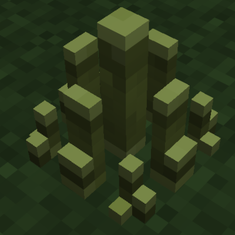
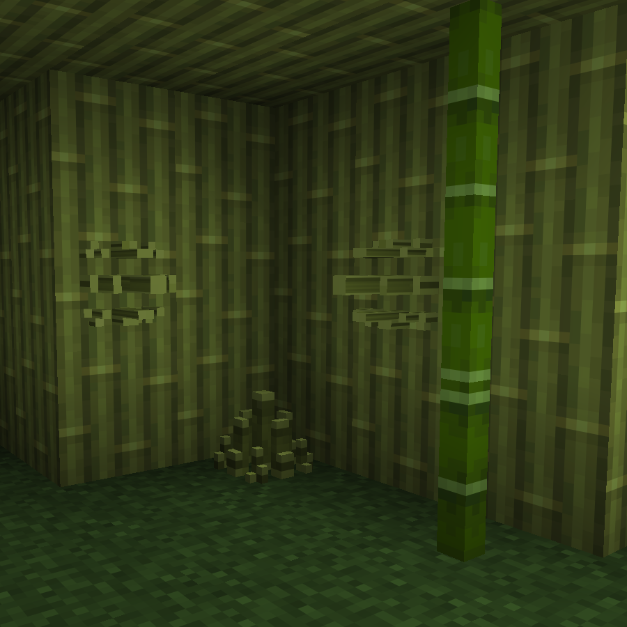

# Bamboo Spikes

A Fabric mod for Minecraft 1.21.11 that adds bamboo spikes - a trap block that damages anything that touches it.

## Features

- **Bamboo Spikes Block**: A trap that damages any entity that touches it (2 damage per tick)
- **Increased Fall Damage**: Falling onto spikes deals 5x normal fall damage
- **Directional Placement**: Can be placed on any surface (floor, ceiling, walls)
- **No Collision**: Entities walk through the spikes while taking damage
- **Waterloggable**: Can be placed underwater
- **Craftable**: Made from bamboo

## Screenshots

## Installation

1. Install [Fabric Loader](https://fabricmc.net/use/) for Minecraft 1.21.11
2. Download and install [Fabric API](https://modrinth.com/mod/fabric-api)
3. Download the latest release of Bamboo Spikes
4. Place the jar file in your `mods` folder

### Server-Side Installation

This mod works on servers with vanilla clients! When installed on a server:
- Vanilla clients will be prompted to download a resource pack
- If accepted, they see custom textures
- If declined, gameplay features still work

Polymer is bundled with the mod - no additional downloads required.

## Requirements

- Minecraft 1.21.11
- Fabric Loader 0.18.0+
- Fabric API
- Polymer (bundled)

## License

This project is licensed under the MIT License - see the [LICENSE](LICENSE) file for details.
