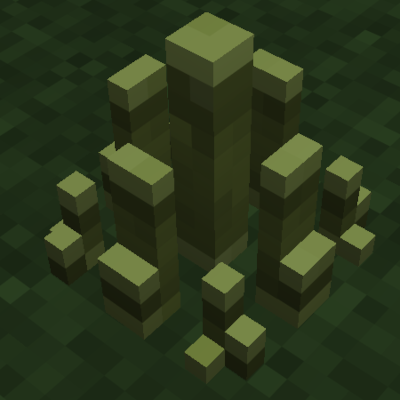
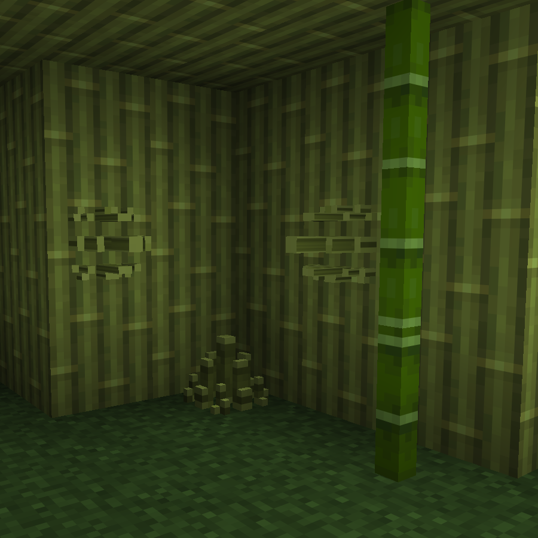

# Bamboo Spikes

A Fabric mod that adds bamboo spikes - a trap block crafted from bamboo that damages anything that touches it.

## Features

- **Bamboo Spikes Block**: A trap that damages any living entity (including players) that touches it
- **Increased Fall Damage**: Falling onto spikes deals 5x normal fall damage
- **Directional Placement**: Can be placed on any surface (floor, ceiling, walls)
- **No Collision**: Entities walk through the spikes while taking damage
- **Waterloggable**: Can be placed underwater
- **Craftable**: Made from bamboo

## Screenshots

## Requirements

Targets the Minecraft, Fabric Loader, Fabric API, and Java versions declared in this mod's `gradle.properties`; check there for the exact currently-supported version.

## Pandorical

Bamboo Spikes uses Pandorical to register its block and item models and sync them (and the mod's other assets) to clients for correct rendering. Pandorical is declared as a hard dependency in `fabric.mod.json`, so it must be installed on both server and client for this mod to load at all: there is no vanilla-client fallback.

## Installation

Install alongside its declared dependencies (see `fabric.mod.json`).

## License

This project is licensed under the MIT License - see the [LICENSE](LICENSE) file for details.
